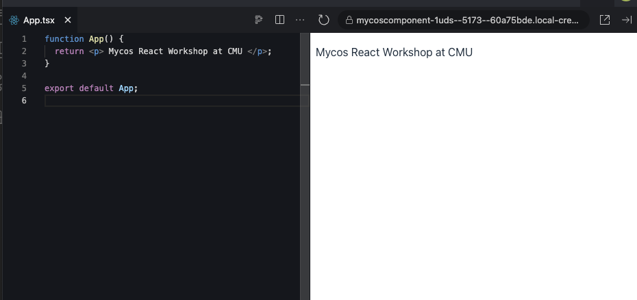
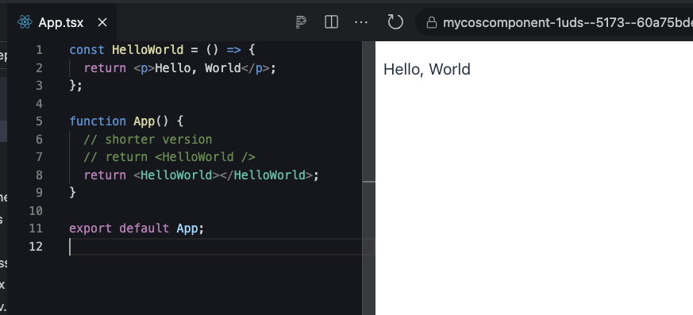
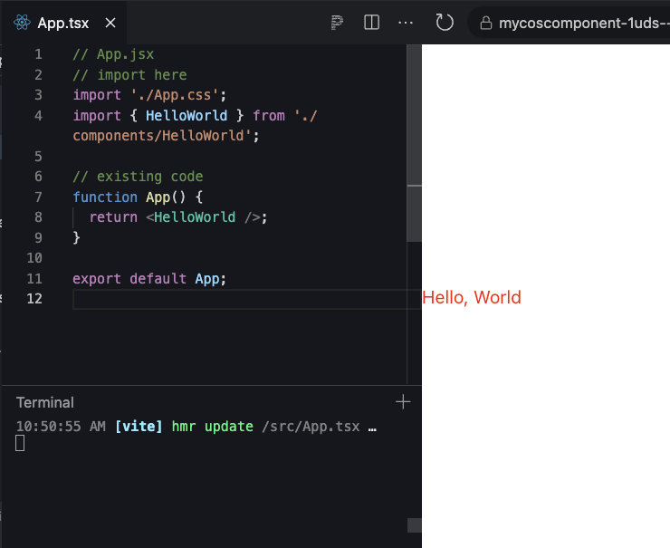

# First Component

Previously we known React App combine multiple components, this section we will drive at one component
start with `App.tsx` component then we will create another component.

## Root Component

In this workshop we have `App.tsx` is root component

```jsx
function App() {
	return <p>Mycos React Workshop at CMU</p>
}
```



### component explanation

explain line by line;

1 Declare component named App, it Look like function in JavaScriptß

2 `return` this API will always use in other component, it is `JSX` which rendering to html
JSX is not HTML, it can has logic or expression, we will see more later.
After JSX rendered it will become UI like section right in the picture above.

5 `export` this API will tell any component in React can import and use it (will explain more later).

## Create HelloWorld Component

Press F to respect, Hello World; We will create HelloWorld Component

### locate App.tsx

Everything in React (mostly) start here.
Open `App.tsx` file in `src\App.tsx`

### type to create a component

we type the code below to create a hello world component

```jsx
// start here
const HelloWorld = () => {
	return <p>Hello, World</p>
}

// this is existing code
function App() {
	return <p>Mycos React Workshop at CMU</p>
}

export default App
```

**note.** Javascript nowadays (31 Aug 2024) can creating component two types

1. "function syntax"

```jsx
function HelloWorld () {
  return <p>Hello, World!<p>
}
```

2. Arrow syntax

### Use the Hello World Component

wait, we already created component but where is the Hello World?
we created -> yes and then we have to use it too in the `App.jsx`

```jsx
const HelloWorld = () => {
  return <p>Hello, World</p>
}


function App() {
  // shorter version
  // return <HelloWorld />
  return <HelloWorld></HelloWorld>;
}

export default App;
```

So, the Hello, World! should show in the UI now.


## Import & Export Component

We should not store all code in one file, we will separate HelloWorld out from` App.tsx`

1. Create file in src/components folder Called `HelloWorld.tsx`, why don't `.jsx`? we use TypeScript will explain later
2. Move HelloWorld component in `App.tsx` to the file we just created.
3. add `export` in the first line, `export const ....`

```jsx
// HelloWorld.tsx
export const HelloWorld = () => {
  return <p>Hello, World</p>
}
```

4. back to App.tsx on above file, we import HelloWorld component

```jsx
// import here
import { HelloWorld } from "./components/HelloWorld"

// existing code
function App() {
	return <HelloWorld />
}
```

brief:

`export` we already known which it make other component able to see.

`import` before we use other component in our component, we have to use this api.

## Styling Component

we use CSS for styling like regular HTML.
but in JSX of React we have two ways

1. create `style.css` file and don't forget to import it into App.
2. use inline style `props`? we will discuss `Props` in the next section.

```css
/* App.css */
body {
	margin: 0;
	display: flex;
	place-items: center;
	min-width: 320px;
	min-height: 100vh;
}

.text-red {
	color: red;
}
```
**********************
```jsx
// App.jsx
// import here
import "./App.css"
import { HelloWorld } from "./components/HelloWorld"

// existing code
function App() {
	return <HelloWorld />
}
```
**********************

```jsx
// HelloWorld.tsx
export const HelloWorld = () => {
	return <p className="text-red">Hello, World</p>
}
```

Well, now we see a new one `className="text-red"` which className is a `Props`

**Note** import always stay on top of component file


<!-- <iframe src="https://stackblitz.com/edit/mycos-component?embed=1&file=src%2FApp.tsx&embed=1" style={{width: "100%", height: "400px", border: 0}}></iframe> -->
