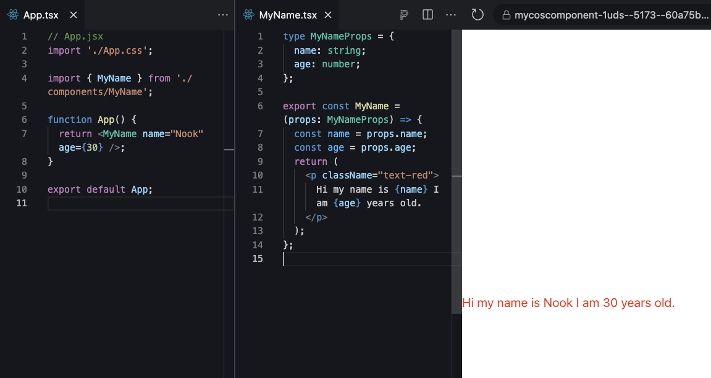

# React Props

What is React Props? object data properties which receive from parent Component

`props` cannot be changed, it read only AKA `immutable`.

`props` can declare any type, string, number, function, object ...

## Create MyName Component

Example we Create Component Call `MyName.tsx` in the src/components folder

**props always stored inside bracket of Component**

```jsx
// MyName.tsx

type MyNameProps = {
	name: string,
}
export const MyName = (props: MyNameProps) => {
	const name = props.name
	return <p>Hi {name}</p>
}
```

Ops!, many new words appear. What are those,`parent Component`, `type`, `MyNameProps`, `name: string`, `{name}` ....

---

use in App.tsx

```jsx {2,5}
// App.tsx
import { MyName } from "./components/MyName"

function App() {
	return <MyName name="Nook" />
}
```
Passing value to the name prop with `name="Nook"`

Parent now is: `App.tsx`

Since we use typescript, we have to declare type or interface of Component Props.

MyName want one prop called name which is type string.

## Challenge

Can we passing `age` from `App.tsx` too?
Also show `age` in MyName Component.


## Answer

<details>
  <summary>Show me</summary>
  
  

    ```jsx {4,9,12}
// MyName.tsx
type MyNameProps = {
name: string;
age: number;
};

    export const MyName = (props: MyNameProps) => {
    const name = props.name;
    const age = props.age;
    return (
        <p class="text-red">
        Hi my name is {name} I am {age} years old.
        </p>
    );
    };
    ```

---

    ```jsx {6}
    // App.tsx
        import './App.css';
        import { MyName } from './components/MyName';

        function App() {
            return <MyName name="Nook" age={30} />;
        }
    ```
    `name="Nook"` will be string but our age property is number so we passing `age` with **curly bracket** instead



</details>
