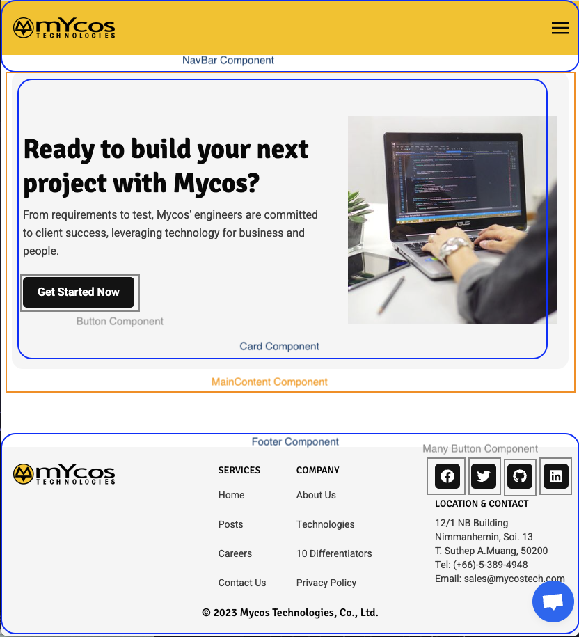
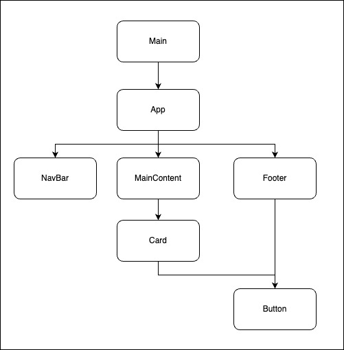
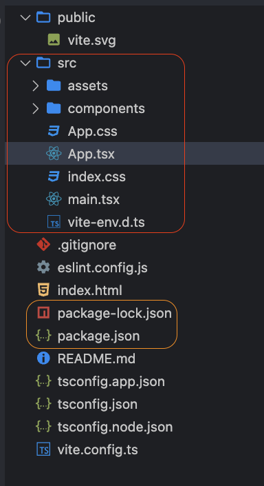

# Tutorial Intro
We will building web application with React, teach by Mycos teams

## Goals
- Learn about Basic React, components, JSX, props, state, hook
- Build a simple application, Flip self Card
- **Able to research next level of React by yourself**

## What is React
React is JavaScript library, used to build user interfaces (UI) on the front end.

React build SPA web (Single page Application) which mean it did not reload all page after we interactive any part of UI.

React assembles by many Components to became webApp (Or mobile in React Native)

Example mycostech.com, many components become one.


## Behind the scene 
Top Level, React build and bundle javascript render all components into script file than apply to `index.html`

React combine all components like a tree, thus it have to had a root component.
example mycostech.com on above in diagram


## Getting Started
Get started by **creating a new component**.

### Prerequire

- [Node.js](https://nodejs.org/en/download/) version 18.0 or above:
- Basic knowledge HTML, JavaScript, CSS 

### Clone or download project
we will clone if familiar with git or not; just download.

```bash
git clone 
```

## Start project

Run the development server:

```bash
cd my-website
npm run start
```

The `cd` command changes the directory you're working with. In order to work with mycos example project, you'll need to navigate the terminal there.

The `npm run start` command builds your website locally and serves it through a development server, ready for you to view at http://localhost:3000/ or other port. 

## Project Structure
This workshop will have folder structure;


### src/ folder
The red section in picture above, this main content that we will implement application with React, in details we will drive into it later.

### index.html
Final version of any web app it should contain one or multiple html but it will always have one root .html, in SPA app

all our react code will combine into main.tsx at
`<script type="module" src="/src/main.tsx"></script>`
```html
<!DOCTYPE html>
<html lang="en">
  <head>
    <meta charset="UTF-8" />
    <link rel="icon" type="image/svg+xml" href="/vite.svg" />
    <meta name="viewport" content="width=device-width, initial-scale=1.0" />
    <title>Mycos React Workshop 2024</title>
  </head>
  <body>
    <div id="root"></div>
    <script type="module" src="/src/main.tsx"></script>
  </body>
</html>
```

### package.json
The orange section, this file contains all package/ third party names and versions, scripts to run or do some specific job.

`package-lock.json` will ensure we install the same version on any machine.