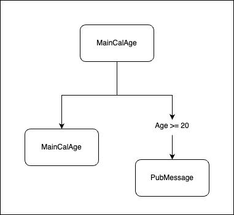
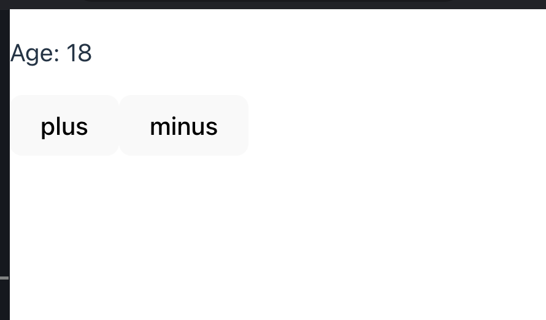
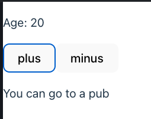
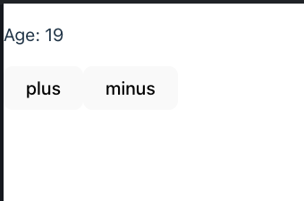

# Nested Components
We combine multiple components into App, here we will add an example three components
`MainCalAge` component which have two button plus/minus, `ShowAge` component which show age in any style, and `PubMessage` component which show "you can go pub"



Why we have three components instead one since it can done in one component?

In the real world or mostly culture we should make component less than lines code or one Component do on job, separate of concern, etc...

That make code more readable, maintainable. Conclusion
- `MainCalAge` => Handle the age logic and age state.
- `ShowAge` => Show text age.
- `PubMessage` => Show text pub.


## Start with MainCalAge
first we create file `MainCalAge.tsx` in component (Look like Counter Component)
then create this Component inside file (don't forget to export)

```jsx
// MainCalAge.tsx

export const MainCalAge = () => {

    return (
        <p> main cal age work! </p>
    )
}

```

**Next**

1. Import in `App.tsx` and use
2. Add `state` with `useState` hook (can be any name; example `[age, setAge]`) and default value with `18` has `number` type.
3. Show age in paragraph tag `<p>Age: ...</p>`
4. add two buttons plus which increase state +1, minus which decrease state - 1


### Final code
here codes
```jsx
import { useState } from 'react';

export const MainCalAge = () => {
  const [age, setAge] = useState<number>(18);

  return (
    <div>
      <p>Age: {age}</p>

      <button onClick={() => setAge((prev) => prev + 1)}>plus</button>

      <button onClick={() => setAge((prev) => prev - 1)}>minus</button>
    </div>
  );
};

```



## ShowAge Component
Next we will move `Age: ` text paragraph from `MainCalAge` into new component, ShowAge
at the same file 

We can create multiple component in one file and not necessary to export every component since we just create a component for separate of concern

1. Create `ShowAge` Component with receive `age props` (Don't forget to create prop type)
2. Move Age text out from `CalMainAge` into `ShowAge`
3. Use `ShowAge` component instead in CalMainAge and pass `age state` to show the Age.

```tsx {5-10,17}
// MainCalAge.tsx
import { useState } from 'react';

// this use destructing, equal const age = props.age
type ShowAgeProp = {
  age: number;
};
const ShowAge = ({ age }: ShowAgeProp) => {
  return <p>Age: {age}</p>;
};

export const MainCalAge = () => {
  const [age, setAge] = useState<number>(18);

  return (
    <div>
      <ShowAge age={age} />

      <button onClick={() => setAge((prev) => prev + 1)}>plus</button>

      <button onClick={() => setAge((prev) => prev - 1)}>minus</button>
    </div>
  );
};

```

The UI result should be the same.

Optional, we can decorate the `ShowAge`.

## PubMessage component and JSX condition
We will create pub message component also this component appear in MainCalAge when age >= 20 only

1. Create PubMessage component at the `MainCalAge.tsx file`.
2. Return Jsx one paragraph `You can go to a pub` or any words
3. use this component in `MainCalAge` with condition age >=20

```tsx {4-6,26}
// MainCalAge.tsx
import { useState } from 'react';

const PubMessage = () => {
    return <p>You can go to a pub</p>
}

type ShowAgeProp = {
  age: number;
};
const ShowAge = ({ age }: ShowAgeProp) => {
  return <p>Age: {age}</p>;
};

export const MainCalAge = () => {
  const [age, setAge] = useState<number>(18);

  return (
    <div>
      <ShowAge age={age} />

      <button onClick={() => setAge((prev) => prev + 1)}>plus</button>

      <button onClick={() => setAge((prev) => prev - 1)}>minus</button>

      {age >= 20 && <PubMessage />}
    </div>
  );
};

```
### UI Result
when age >= 20



if not



## Lifecycle of Component 
what is it? to summary it contain API from creating Component into destroyed component we will use `Hook API` called `useEffect`.

### useEffect Hook
The useEffect Hook will called after dependencies changed

Syntax
```tsx
const Component = () => {

    
}
useEffect(() => {
    // Do something

    // Optional
    return () => {

    }
}, [dependencies])
```

useEffect contains

1. `Callback` which will call after dependencies changed.
2. `return callback` inside Callback from 1, this optional, will use when needed.
3. `dependencies` this will make useEffect called or trigger after it changed, this can contains multiple dependencies or empty **(Empty mean it called once when a component created)**

### Example with our MainCalAge
First we import useEffect from react

```tsx {5-6,8-9,24-26}
// MainCalAge.tsx
import { useEffect, useState } from 'react';

const PubMessage = () => {
  useEffect(() => {
    console.log('PubMessage component created after age >= 20');

    return () => {
        console.log('PubMessage component being destroy')
      // this will called when component being destroy 
      // which mean after 
      // age change from more than 20 and it back to lower 20 again this will called
    };
  }, []); //Empty dependencies, will called only when component created 
  // which mean this component created after age >=20

  return <p>You can go to a pub</p>;
};

type ShowAgeProp = {
  age: number;
};
const ShowAge = ({ age }: ShowAgeProp) => {
  useEffect(() => {
    console.log('age changed: ', age);
  }, [age]);

  return <p>Age: {age}</p>;
};

export const MainCalAge = () => {
  const [age, setAge] = useState<number>(18);

  return (
    <div>
      <ShowAge age={age} />

      <button onClick={() => setAge((prev) => prev + 1)}>plus</button>

      <button onClick={() => setAge((prev) => prev - 1)}>minus</button>

      {age >= 20 && <PubMessage />}
    </div>
  );
};
```
