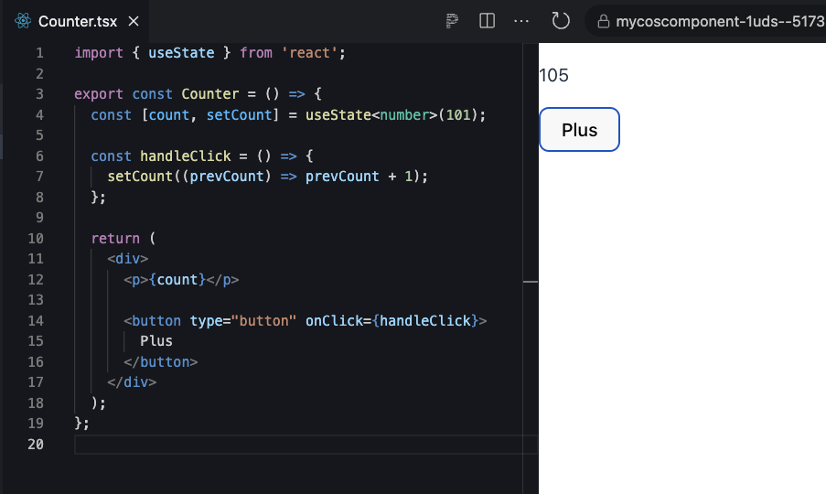

# State And Event
state mainly is manipulate data inside React and Event is HTML event which we do in the web app e.g. click, scroll, submit etc...

## React State
State is different from props that props receive only cannot change itself, unlike state can update a data.

start with `useState` which is part of `react hook`

syntax

```jsx
// first import useState api from react
import { useState } from 'react'

//       state   setState fn           state type, default value of state
  const [count, setCount] = useState<number>(101)
```


`count` is state cannot change, it is still be `immutable`.

`setCount` function to change the `count`, we want to change the `count` but the theory said `count` must be `immutable` so to setting a count we have to set with new value only with this callback.

`<number>` type of this state, now it is number.

`(101)` default value of this state which the `count` will be 101 at the beginning.

Why useState return `array`? it can declare any variable state name, also setter function, but have to use in correct index.

`hook` in React mean React API helper which start with `use`
- useState
- useContext
- useRef
- etc...

Can declare and use inside any Component

## Event
JSX can bind HTML event but unlike original HTML, JSX use any HTML prop with `camelCase`

### onClick event
We can bind onclick event
```html
<button onclick="myFunction()">Click me</button>
```

example onClick event in JSX
```jsx
<button 
    onClick={() => {}} 
>
    Click me
</button>
```
`() => {}` this is anonymous function means function without name

`onClick` is the html props, receive `callback` `() => {}` (well just think about it is a function for now)

### onChange event
Any input field, mostly use `onChange` event to keep the typing input data.
```jsx {3}
<input
    type="text"
    onChange={(event) => {
        console.log('text: ', event.target.value);
    }}
></input>
```

## Counter Component
Counter component is the good way to understand `useState` hook

### Create Counter component
Like old one, Create `Counter` component in src/components

1. import a useState from react(this should be help from VScode)
2. declare count and setCount
3. render count in JSX

```jsx
// Counter.tsx

import { useState } from 'react';

export const Counter = () => {
  const [count, setCount] = useState<number>(101);

  return <p>{count}</p>;
};

```

4. use in App.tsx (Ops!, I don't remember again)

We will get the 101 result.

### Change count state by onClick event
We want to change the `count`, it has multiple ways, a way to done it via onClick event.

1. Declare handleClick function inside the component.
2. Add `div` tag to be root of this component (don't forget root of any component should be one level)
3. create a `button` inside `div` call "Plus" or any name
4. bind onClick props with function from 1.
5. We can use setter state `useCount` on below;

```jsx {9-11,17}
//Counter.tsx

import { useState } from 'react';

export const Counter = () => {
  const [count, setCount] = useState<number>(101);

  // actually type of the onClick event is `event: React.MouseEvent<HTMLButtonElement, MouseEvent>` but now we don't want it.
  const handleClick = () => {
    setCount((prevCount) => prevCount + 1);
  };

  return (
    <div>
      <p>{count}</p>

      <button type="button" onClick={handleClick}>
        Plus
      </button>
    </div>
  );
};

```

`button` has two types
1. `submit` use in `<form>` for submitting, e.g. click or press Enter
2. `button` any click

The `handleClick` function now we use setter state fn to change the count state.



What is `setCount((prevCount) => prevCount + 1)`

### Setter function of useState
Setter state can set a new value of state in many ways
1. Set directly
```jsx
// change new `count` to 300
setCount(300);
```
2. Set via `callback` (this word again!) which callback have to one parameter the previous state and have to return new state.
In Case we want to use previous value to computed.
```jsx
// Best Practice
setCount((prevCount) => {
    return prevCount + 1
});

// Short callback version, if we have one statement it will do and return at one line no curly bracket
setCount((prevCount) => prevCount + 1);

// This can be done too, but not recommend, it may cause issue in the future(now it not difference)
setCount(count + 1);

```
### Challenge Accepted
Create minus button to minus the count by -1

#### Answer
<details>
  <summary>Show me</summary>

```jsx {8,12-14,20,23-25}
//Counter.tsx

import { useState } from 'react';

export const Counter = () => {
  const [count, setCount] = useState<number>(101);

  const handleClickPlus = () => {
    setCount((prevCount) => prevCount + 1);
  };

  const handleClickMinus = () => {
    setCount((prev) => prev -1)
  }

  return (
    <div>
      <p>{count}</p>

      <button type="button" onClick={handleClickPlus}>
        Plus
      </button>
      <button type="button" onClick={handleClickMinus}>
        Minus
      </button>
    </div>
  );
};
```
</details>